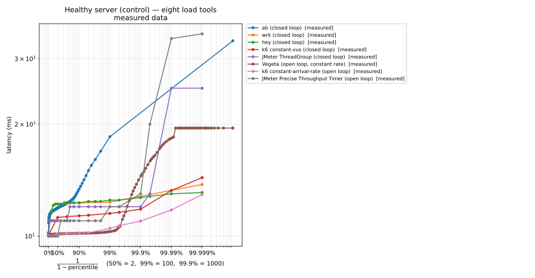
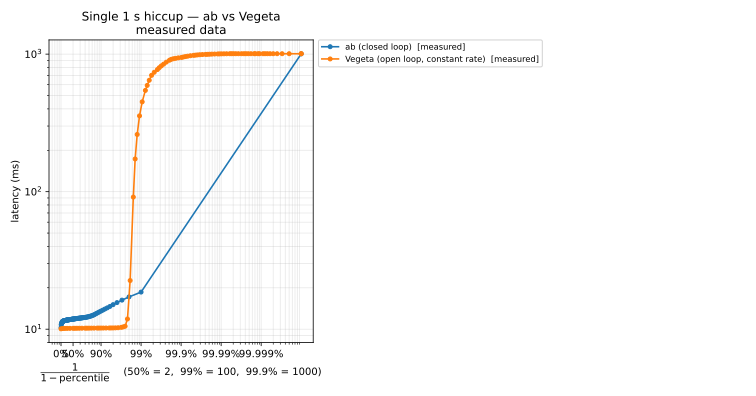
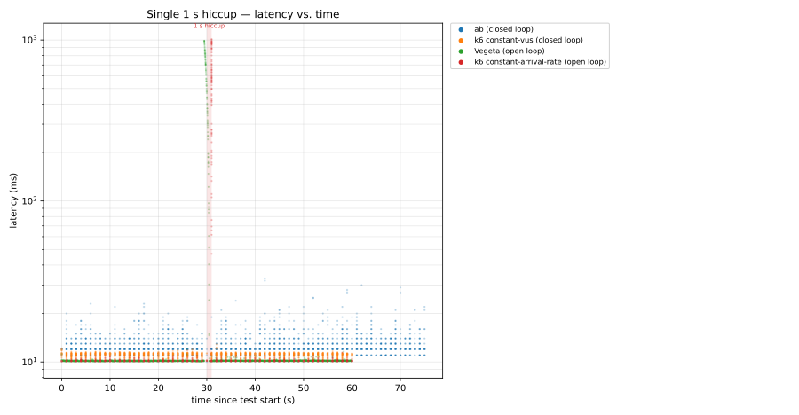
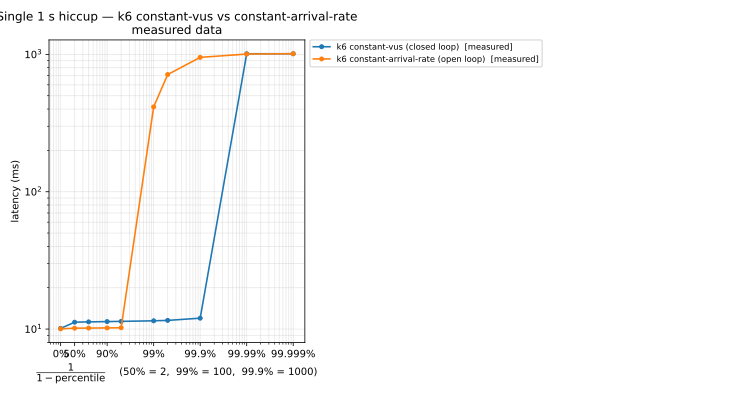
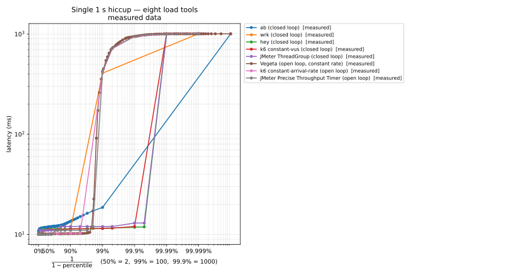
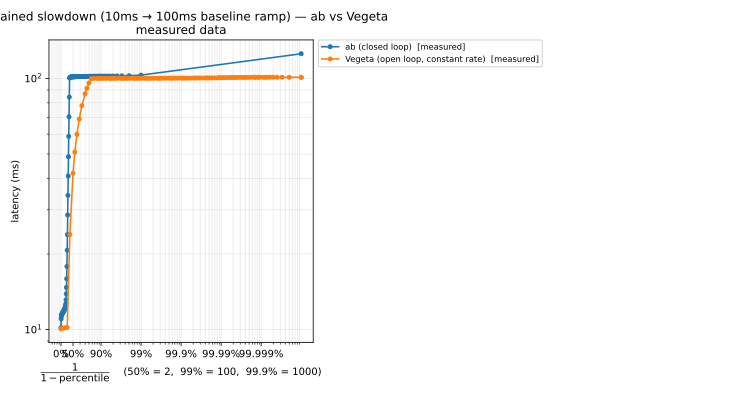
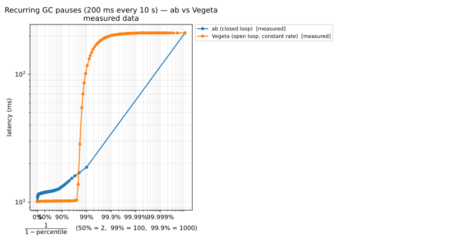
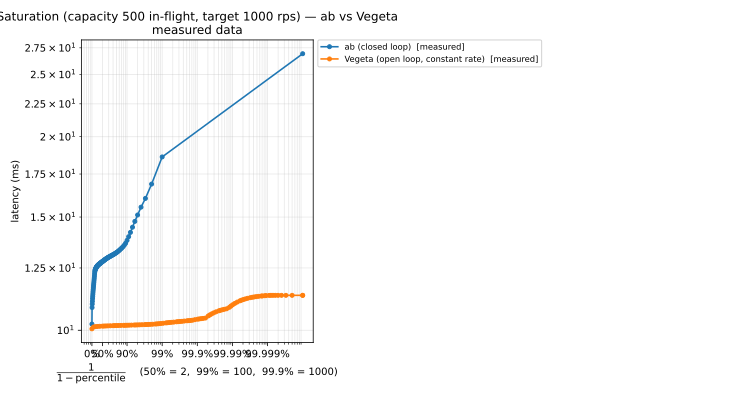

+++
title = "Coordinated Omission: Why Your Latency Numbers Lie"
date = 2026-05-04
toc = true

description = "Most HTTP benchmarking tools quietly hide tail latency when the server slows down. The phenomenon is called coordinated omission, it shows up almost exclusively in p99 and beyond, and it has caused production incidents at organisations that thought their load tests were green. This post explains the mechanism, demonstrates it empirically with a reproducible benchmark of eight tools across five server pathologies, and shows how to fix it with a constant arrival-rate workload model."

[taxonomies]
tags = ["performance engineering", "load testing", "latency", "benchmarking", "HdrHistogram"]

[extra]
giscus = true
copy_button = true
footnote_backlinks = true
+++

> *The load test passed. p99 was 47 ms. In production, the same release showed p99 of 1.8 seconds — a 38× regression that the test had reported as nothing. Nothing was wrong with production. Everything was wrong with how we measured.*

This article is about a single, specific failure mode in load testing — one that is well known to a small number of practitioners and almost completely invisible to everyone else. It is called **coordinated omission**, the term was coined by Gil Tene around 2013, and it explains why a benchmarking tool that works perfectly under healthy conditions can become catastrophically optimistic the moment the system under test starts to struggle.

If you write or interpret load tests, this is the kind of phenomenon you want to internalise once and never have to re-learn. To make the demonstration concrete rather than rhetorical, the post is backed by a [companion repository](https://github.com/be-next/Coordinated-Omission) that runs eight load tools against five reproducible server pathologies. Every plot below is generated from real measurements; the numbers are reproducible on any modern laptop in under five minutes per scenario.

## The benchmark loop

Most HTTP benchmarking tools — `ab`, `wrk`, `hey`, the default scenarios in JMeter and Gatling, naïve scripts in any language — operate on a simple synchronous loop:

```text
for each virtual user:
  while test is running:
    t_start = now()
    send_request()
    wait_for_response()
    t_end = now()
    record(t_end - t_start)
```

When the server is healthy, this loop is fine. Each iteration takes a few milliseconds, requests stream out at a steady rate, and the reported latencies match what real users would have experienced.

The problem is what happens when the server slows down.

## What coordinated omission is

Suppose, midway through a five-minute test, the server experiences a 1-second hiccup — a long garbage collection pause, a cache miss, a brief network blip. During that second, every virtual user in the loop is **blocked waiting for its response**. No new requests are sent. When the server recovers, the virtual users record one slightly slow response each (around 1 second), then resume the normal rhythm.

The reported latency distribution will contain those one-per-VU slow responses. What it will *not* contain is the **swarm of requests that real production traffic would have sent during the slowdown** — and that real users would have observed waiting for far more than 1 second each, because they would have been queued behind the recovering server.

The benchmarking tool has, in effect, coordinated with the server: when the server stopped responding, the tool stopped sending. The tool has *omitted* the requests that would have demonstrated how bad the slowdown actually was. Hence the name.

This is not a bug in any single tool. It is a structural consequence of the closed-loop request model — what queueing theorists call a **closed workload model**.

## A reproducible experiment

The [companion repository](https://github.com/be-next/Coordinated-Omission) ships a deliberately misbehaving Go HTTP server, eight load tool runners, and an analysis pipeline that turns raw HDR/CSV outputs into the SVG plots used here. Five scenarios isolate distinct server pathologies; the same eight tools probe each one. Every measurement in this article comes from this suite.

The shared profile across all scenarios is identical:

| Parameter        | Value     |
|------------------|-----------|
| Test duration    | 60 s      |
| Target rate      | 1 000 rps |
| Baseline latency | 10 ms     |

The five scenarios add a different pathology on top of that baseline:

| Scenario | Pathology | What it shows |
|----------|-----------|---------------|
| 01-healthy | none (control) | All eight tools agree when nothing is wrong |
| 02-single-hiccup | one 1-second stall at t=30 s | The canonical case — closed-loop hides the stall at p99 |
| 03-sustained-slowdown | linear ramp 10 ms → 100 ms over 30 s | Coordinated omission *fades* under regime change |
| 04-gc-pauses | 200 ms stall every 10 s (× 6) | More realistic than 02; the lie shifts deeper into the tail |
| 05-saturation | concurrency cap that may or may not bind | Open-loop measurement collapses into timeout-dominated noise |

The control scenario is the falsification test. If the eight tools disagree in scenarios 02–05 but **agree in scenario 01**, the divergence cannot be a property of the tools. It has to be a property of the phenomenon being measured.


*Scenario 01 (control). Every percentile from p50 to p99.99 lands within ~30 ms across all eight tools. There is no closed-loop / open-loop split. Whatever divergence the next scenarios produce is real, not instrumental.*

## The canonical case: a 1-second hiccup

Scenario 02 reproduces the textbook situation. A single 1-second pause is scheduled at t=30 s — modelling a stop-the-world GC pause as observed from the client. All eight load tools run the same 60-second / 1 000 rps profile against the same server.

The result, plotted as a percentile spectrum:


*Scenario 02 — `ab` (closed loop) vs Vegeta (open loop, constant rate). The two curves agree from p50 to p95, then diverge by ~30× at p99 (~14 ms vs ~420 ms). They reconverge at p99.9 only because the 1-second stall is so long it cannot stay hidden any longer.*

The same effect, viewed as a timeline of individual response latencies:


*Scenario 02 timeline. The shaded band is the 1-second hiccup window. `ab` (top, closed-loop) records about ten stalled samples — one per virtual user that happened to be in flight when the gate closed. Vegeta (bottom, open-loop) records the full queueing wedge of ~1 000 requests that arrived during the stall and unblocked together when it ended. The two tools were instrumented identically; they are looking at the same server. They are measuring different things.*

This is the empirical illustration of the article's central claim, in two pictures.

## Why tail latency takes the biggest hit

Average latency is mostly immune to coordinated omission. By definition, slow requests are rare events; the omitted ones do not move the mean meaningfully. In scenario 02, the average reported by `ab` is **11.7 ms**; the average reported by Vegeta is **18.4 ms**. The closed-loop number is barely 6 ms off — close enough to look fine on a dashboard.

The trouble lives in the tail. In the same scenario:

| Percentile | closed-loop tools | open-loop tools | factor |
|------------|-------------------|-----------------|--------|
| p50        | ~10–12 ms         | ~10 ms          | 1× |
| p95        | ~12–15 ms         | ~10 ms          | 1.5× |
| **p99**    | **~12–19 ms**     | **~400–450 ms** | **~25–40×** |
| p99.9      | ~1 000 ms         | ~950 ms         | 1× |
| p99.99     | ~1 000 ms         | ~1 000 ms       | 1× |

The reported tail at p99 is **between one and two orders of magnitude better than reality**. And it is the *tail* that production users care about: at scale, p99 of 420 ms means that 1 % of all requests — possibly tens of thousands of users per minute — see an unusable system. p99 of 14 ms tells the dashboard nobody is suffering.

Coordinated omission systematically hides the failure modes that matter most for user experience.

## The fix: constant arrival rate

The structural fix is to drive load at a **fixed arrival rate** rather than at a rate determined by the server's responsiveness. This is the **open workload model**: requests are scheduled to start at predetermined times, and they are issued at those times whether or not the previous requests have completed.

When the server slows down, the requests pile up — exactly as they would in production traffic from a large user base. Each request's reported latency includes the time it spent waiting in the queue before being issued, often called the **intended-start-time correction**. This is the mathematical sleight of hand that makes the measurement honest: the tool computes latency from when the request *should* have started, not from when it *actually* started.

Three tools were designed from the outset around this principle:

- **wrk2** — Gil Tene's fork of `wrk`. Adds a constant rate flag (`-R`) and uses HdrHistogram internally for high-fidelity recording.
- **Vegeta** — Go-based load testing library with a clean constant-rate mode (`-rate`) and excellent reporting.
- **Hyperfoil** — JVM-based distributed load testing framework explicitly built around an open workload model. The most rigorous of the three for large-scale and distributed scenarios.

A fourth tool worth noting: **k6** offers a `constant-arrival-rate` executor that, when used correctly, also avoids coordinated omission. The default executors (`shared-iterations`, `constant-vus`) do not.

## A worked example in k6

The same load profile, written two ways:

```javascript
// ❌ BAD — closed loop. Susceptible to coordinated omission.
// The 50 VUs each loop as fast as the server allows.
// If the server slows down, the loop slows down, requests are not sent.
export const options = {
  scenarios: {
    susceptible: {
      executor: 'constant-vus',
      vus: 50,
      duration: '1m',
    },
  },
};

export default function () {
  http.get('http://127.0.0.1:8080/api');
}
```

```javascript
// ✅ GOOD — constant arrival rate. Coordinated-omission-aware.
// k6 schedules 1 000 requests/sec regardless of response time.
// Slow responses pile up and contribute to honest tail-latency numbers.
export const options = {
  scenarios: {
    honest: {
      executor: 'constant-arrival-rate',
      rate: 1000,
      timeUnit: '1s',
      duration: '1m',
      preAllocatedVUs: 1500,
      maxVUs: 5000,           // headroom for slow-response queuing
    },
  },
};

export default function () {
  http.get('http://127.0.0.1:8080/api');
}
```

The two scripts produce the following side-by-side under scenario 02:


*Scenario 02 — k6 in both modes. `constant-vus` is the closed-loop tracking curve; `constant-arrival-rate` is the open-loop tracking curve. Same tool, same target server, same load profile. The choice of executor changes the reported p99 by a factor of ~25.*

**A k6 footgun worth knowing.** The `constant-arrival-rate` executor is only honest if `preAllocatedVUs` and `maxVUs` are large enough to absorb the slow-down peak. If the pool saturates, k6 reports `dropped_iterations` and silently *omits* the queued requests — partially reintroducing coordinated omission while *advertising* an open-loop model. The configuration above pre-allocates 1 500 VUs with a ceiling of 5 000 to be safe at 1 000 rps across a 1-second stall (where the queue can reach ~1 000 simultaneously waiting requests). The companion repository's `k6-good` runner uses these exact values; reduce them at your peril.

## Tools at a glance

The full eight-tool spectrum on scenario 02:


*Scenario 02 — eight tools on one plot. The closed-loop cluster (`ab`, `hey`, `k6 constant-vus`, JMeter ThreadGroup) hugs the baseline through p99. The open-loop cluster (Vegeta, `k6 constant-arrival-rate`, JMeter Precise Throughput Timer) climbs to the queueing wedge from p95 onward. `wrk` sits between the two — see the caveat below.*

The published behaviour, summarised as a reference table:

| Tool | Default model | CO-aware? | Notes |
|------|---------------|-----------|-------|
| **ab** (Apache Bench) | Closed loop | ❌ | Fine for sanity checks, misleading for tail latency |
| **wrk** | Closed loop | ⚠ borderline | Conventionally closed-loop, but its `--latency` HDR output reports a tail much closer to the open-loop tools (~408 ms p99 in scenario 02). The most plausible explanation is that `wrk`'s internal timestamping is closer to *intended start time* than its peers. Treat as borderline, not a clean negative example. |
| **wrk2** | Open (constant rate) | ✅ | Gil Tene's fix; HdrHistogram-backed. Does not build on Apple Silicon out of the box (LuaJIT vendored in `giltene/wrk2` predates arm64). |
| **hey** | Closed loop | ❌ | Convenient CLI, same caveat as `ab` |
| **Vegeta** | Open (constant rate) | ✅ | Clean Go library, good reporting |
| **Hyperfoil** | Open by design | ✅ | Distributed, built explicitly around honest measurement |
| **JMeter** ThreadGroup | Closed loop (default) | ❌ | Default — susceptible |
| **JMeter** Precise Throughput Timer | Open | ✅ | Configurable; honest when used correctly |
| **k6** `constant-vus` | Closed loop | ❌ | Default executor — susceptible |
| **k6** `constant-arrival-rate` | Open | ✅ | Honest when `preAllocatedVUs` / `maxVUs` are sized to absorb the peak (see footgun above) |
| **Locust** | Closed loop | ❌ | Open-rate work in the community, not first-class |

## Beyond the single hiccup

Scenario 02 is the textbook case. Real production pathologies rarely come as a single isolated 1-second stall; they come as recurring sub-second pauses, gradual ramps, or capacity walls. The companion repository ships three additional scenarios specifically because the lesson "closed-loop tools always lie" is too simple to survive contact with reality.

### Sustained slowdown: when closed-loop *stops* lying

In scenario 03 the server's baseline latency ramps linearly from 10 ms to 100 ms between t=20 s and t=50 s, then stays at 100 ms. There is no discrete event — only a regime change. The observed percentile spectrum:


*Scenario 03 (sustained slowdown). At p99 both `ab` and Vegeta land near 100 ms — the new plateau. The split has migrated into the **body** of the distribution: `ab` reports p50 ≈ 100 ms (its run is iteration-counted, so it stays on the wire long enough that the slow late part dominates), Vegeta reports p50 ≈ 42 ms (the fast early part is sampled at the same rate as the slow late part).*

The takeaway is intellectually important: **closed-loop tools do not always lie.** They lie about *hiccups*. They reflect *sustained regimes* — but with a different bias (over- or under-stating the median depending on whether the run is iteration-counted or duration-bounded). The phenomenon to watch for is the *event*, not the *level*.

### Recurring pauses: closer to real production

Scenario 04 holds the gate for 200 ms every 10 s — six pauses across a 60-second test. Each pause is an order of magnitude shorter than scenario 02's, but the recurrence accumulates:


*Scenario 04 (recurring pauses). With 6 × 200 ms × 1 000 rps = ~1 200 affected requests out of 60 000 (= 2 %), the divergence shows up cleanly between p98 and p99.9. At p99 the closed-loop tools still report ~12–19 ms; open-loop tools report ~115 ms (about half the pause duration on average). At p99.9 every tool finally surfaces the 200 ms plateau.*

This is closer to a realistic GC-induced pause profile than the dramatic 1-second stall of scenario 02. The lesson generalises: coordinated omission is not limited to spectacular hiccups. It quietly hides any recurring sub-second pause, with the lie resolving only deeper in the tail.

### Saturation: when open-loop also breaks down

Scenario 05 enforces a maximum number of concurrent in-flight requests at the server. With a non-binding cap, all eight tools agree across the spectrum (the boring case — useful precisely because it shows that a generous capacity ceiling does not, by itself, perturb the measurement):


*Scenario 05 (non-binding cap). When the server has headroom, every tool reports the same answer. The `wrk` slope at the extreme tail is the tool's well-known low-rate sample-collection artefact, not coordinated omission.*

Pushing the cap below `target_rate × baseline_latency` — for example `-max-concurrency 5` against a target of 1 000 rps — saturates the system. Closed-loop tools rate-down to whatever the cap allows (~500 rps in this case) and report healthy latencies. Open-loop tools refuse to slow down, accumulate a queue that grows by ~500 rps each second, and report runaway tail latency until they hit their request timeout.

The open-loop measurement of a saturated system is not honest about latency in any meaningful sense — it is dominated by the **timeout policy**, not by the system under test. This is the limit case of constant-arrival-rate measurement: when the load is impossible, the measurement reflects how the tool handles impossibility, not how the system performs.

## Caveats: when a closed loop is actually correct

The story above might suggest that the open workload model is universally correct and the closed loop is always wrong. That is not quite right.

The two models correspond to two genuinely different real-world situations:

- **Open workload** — requests arrive from an effectively unlimited population that does not slow down when the server slows down. Web traffic, mobile push-driven traffic, and most internet-facing APIs match this model. **Coordinated omission corrupts the measurement here.**
- **Closed workload** — a fixed, finite population of clients each waits for its response before issuing the next request. Think of an internal batch process with N worker threads, or a kiosk system with a handful of physical terminals. The total in-flight count is bounded; when the server slows down, the throughput naturally drops because the clients are blocked. **A closed-loop benchmark is the correct model here.**

Most real systems serve open workloads. Most benchmarking defaults assume closed. That mismatch is the root of the problem. The discipline is not to abolish closed-loop benchmarks — it is to use the right model for the system you are testing.

When in doubt about your real production traffic shape, the open model is the safer default. A test that overstates queueing during a slowdown produces conservative results; a test that understates it produces dangerous ones.

## What to take away

Four things:

1. **Default load-test executors lie about tail latency** when the server is under stress. The lie is structural, not cosmetic, and it scales with the severity of the slowdown — but only for *event-shaped* pathologies (hiccups, recurring pauses), not for sustained regime changes.
2. **Use a constant-arrival-rate workload model** (open) for any system whose production traffic is not bounded by a fixed client count. Use HdrHistogram-backed recording where available.
3. **Verify the model**, not just the numbers. A green load test from a closed-loop tool against an open-workload system tells you almost nothing about how production will behave under stress.
4. **Watch the configuration of open-loop tools too.** The k6 `dropped_iterations` footgun and the saturation regime show that open-loop is not a free pass — it is honest only when the tool has the headroom to absorb the queue and the run is not capacity-bound.

Coordinated omission is the kind of phenomenon that, once you know it exists, you start seeing everywhere. The wrk number that disagreed with the production trace; the green pre-release benchmark followed by the page-out at 14:30; the "p99 was fine in staging" post-mortem note. None of these necessarily *were* coordinated omission. But all of them have it as a candidate cause.

The reproducible suite that backs this article is on [github.com/be-next/Coordinated-Omission](https://github.com/be-next/Coordinated-Omission). Cloning it and running `make scenario-02` takes about three minutes and produces the same plots shown above, on your hardware, against your installed tools. If the article changes how you read your next benchmark, the experiment is the proof.

## Further reading

The references below are also collected in this site's [library of foundational works](/library/), under *Landmark talks*.



Tene, G. *How NOT to Measure Latency* [Conference talk]. [YouTube](https://www.youtube.com/watch?v=lJ8ydIuPFeU). — The definitive treatment, by the originator of the term. Required viewing once in a career.

Tene, G. *HdrHistogram — A High Dynamic Range Histogram*. [hdrhistogram.org](http://hdrhistogram.org/). — The data-structure work that makes honest tail-latency recording tractable at scale.

Schroeder, B., Wierman, A., & Harchol-Balter, M. (2006). Open versus closed: A cautionary tale. *Proceedings of the 3rd USENIX Symposium on Networked Systems Design and Implementation (NSDI)*. — The reference paper on the open-versus-closed workload distinction. Pre-dates the *coordinated omission* terminology but states the underlying queueing-theoretic case clearly.

Grafana k6 Documentation. *Open and closed models*. [grafana.com/docs/k6/latest/using-k6/scenarios/concepts/open-vs-closed/](https://grafana.com/docs/k6/latest/using-k6/scenarios/concepts/open-vs-closed/). — Practical reference for choosing an executor with the right workload semantics.

Ramette, J. *Coordinated-Omission — companion repository* [Code & data]. [github.com/be-next/Coordinated-Omission](https://github.com/be-next/Coordinated-Omission). — Reproducible material for this article: a deliberately misbehaving Go HTTP server, eight load-tool runners, five scenarios, and the analysis pipeline that generates every plot above.


